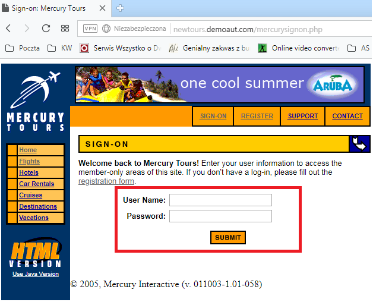

> # **BUG REPORT (BR_0001)**

## *Bug details:*

**System's version:** 011003-1.01-058

**Area affected:** Sign-On module

**Impact:** Medium

**Category:** Incorrect results displayed

**URL:** http://newtours.demoaut.com/mercurysignon.php

**Title: No message is displayed after entering invalid credentials**

**Tester:** Karolina Wardyla

**Raised:** 13/02/2019 at 1:30pm

## *Detailed description:*

**Steps to reproduce:**
1.	Go to the main URL: http://newtours.demoaut.com/mercurywelcome.php
2.	Select Sign-On button from the main menu panel
3.	Enter user name
4.	Enter invalid password
5.	Observe the result

**What was expected?**
1.	User will not be able to sign-on.
2.	After entering valid user name and invalid password, the message “Invalid user name/password” was expected.

**Actual result:**
1.	User is not able to sign-on.
2.	No message is displayed.

## *Environment:*

**Operating system:** Windows 7 Professional

**Browser:** Opera 58.0.3135.53

&nbsp;

_Pic.1 Bug_0001_Screenshot_